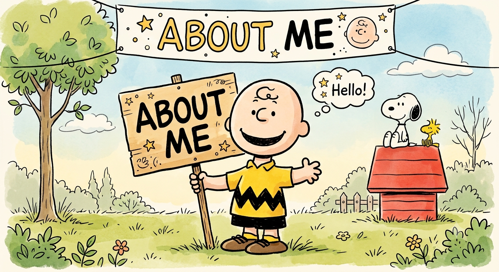

Open main menu

[Home](../)[Teaching](../courses/)[Research](../research/)[Research advice](../research-advice-for-students/)[Project Students](../students/)[About me](../about/)

# About me

Here is the absurd spectacle of modern life.

People fall in love, argue, steal, struggle, become lonely, try to help each other, endure politicians and crises, grow older, dream of escaping and carry on regardless.

There is no neat explanation.

C’est la vie.

## Professional profile

• I’m fundamentally a software engineer and programmer.

• I’ve given invited talks on academic and industrial research.

• I’ve run research projects, most of them involving industry.

• I’ve been involved in several web-industry events, which are tiring but fun.

• I’ve served as an external examiner for BSc and MSc programmes and PhDs.

• I’ve given invited lecture courses in many places.

• In my spare time I write articles and books, and develop online courses for beginners and professionals.

• I am a bit of a nonconformist—as my colleagues would readily confirm.

Long COVID

I'm one of those people that is suffering from ”Long COVID" which has presented itself as a cluster of symptoms that are overlapping and fluctuating.

My symptoms include breathlessness, headaches, cough, fatigue and cognitive impairment or "brain fog’"; it has caused long-term lung issues, which is why my students sometimes receive a lecture from "Darth Vader"!

Memberships

- AAAI - American Association for Artificial Intelligence
- AAISB - Association for Artificial Intelligence and Simulation of Behaviour
- ACM - Association for Computing Machinery
- ALT - Association for Learning Technology
- BCS - British Computer Society
- IEEE - Institute of Electrical and Electronics Engineers
- IET - The Institution of Engineering and Technology

Education

- PhD in Computer Science, 1990  
University College London, Dept of Computer Science
- Bachelor of Science in Computer Science, 1983  
Polytechnic of Central London, Dept of Computer Science
- Higher National Diploma in Computing, 1982  
Polytechnic of Central London, Dept of Computer Science

A bit of history

I received the B.Sc. degree with first class honours in Computer Science (CNAA) from the Polytechnic of Central London. I also have an HND with Distinction in Computer Studies for what it is worth! Studying at a Polytechnic was a conscious decision for me - I wanted to avoid the "ivory towers" view of life; I received some support from Esso (bang goes my Green credentials).

Whilst an undergraduate I did a fair amount of external consultancy - the money came in very useful! I then went on to study for my Ph.D. degree at University College London in the area of electronic document retrieval under Professor Clement Leung. As a research student I continued to do external consultancy and teaching at various Colleges. I took up a full-time lectureship at Birkbeck in 1986 (that long ago!).

I've continued to foster links with industry (see my research pages) and work in the areas of programming languages (especially languages for the JVM and OSX), software engineering, and visual information systems (multimedia information retrieval).

[Home](../)[Teaching](../courses/)[Research](../research/)[Research advice](../research-advice-for-students/)[Project Students](../students/)[About me](../about/)© 1986-2026 KEITH LEONARD MANNOCK All rights reserved.