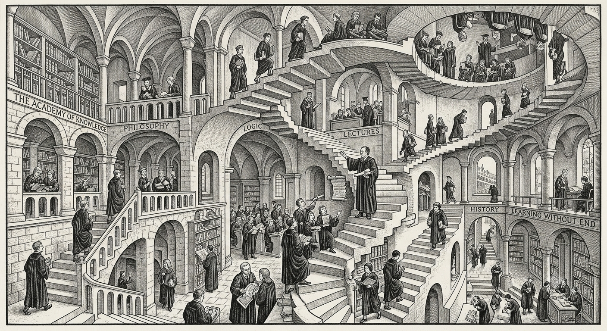

Open main menu

[Home](../)[Teaching](../courses/)[Research](../research/)[Research advice](../research-advice-for-students/)[Project Students](../students/)[About me](../about/)

# Teaching

My teaching focusses on software based topics utilising[blended learning techniques](https://www.heacademy.ac.uk/enhancement/starter-tools/blended-learning).

## 2026–27

- [Software and Programming III](https://www.bbk.ac.uk/study/modules/buci/BUCI056H6)— 15 credits/level 6 (Spring term)
- [Introduction to Computer Systems](https://www.bbk.ac.uk/study/modules/buci/BUCI008H4)— 15 credits/level 4 (Spring term)
- Programming Primer (Introductory short courses for each degree programme) — September and December

## Archived courses

- Applied Software Engineering (2019-2024)
- Software Design and Programming (2012-2022)
- Programming Language Paradigms (2011-2022)
- Programming Paradigms and Languages (2011-2022)
- Programming Primer (2014-2021)
- Enterprise Computing (2012-2020)
- Component-Based Software Development (2000-2020)
- Principles of Programming I (2017-2018)
- Principles of Programming II (2017-2018)
- Programming in Java (2011-2018)
- Software and Programming II (1994-2013)
- Middleware (2010-2012)
- Introduction to Software Development (2009-2012)

- Object-Oriented Design and Programming (2007-2011)
- Component Technologies (2000-2010)
- Introduction to eBusiness (1999-2006)
- Object-Oriented Programming in Java (1997-2006)
- Software and Programming I (1993-1999)
- Object-Oriented Programming in C++ (1991-1996)
- Neural Networks (1990-1994)
- Information Retrieval (1990-1993)
- Advanced Programming Techniques I and II (1987-1992)
- Expert Systems and Artificial Intelligence (1986-1995)
- Operating Systems (1986-1989)
- Database Systems (1982-1989)

[Home](../)[Teaching](../courses/)[Research](../research/)[Research advice](../research-advice-for-students/)[Project Students](../students/)[About me](../about/)© 1986-2026 KEITH LEONARD MANNOCK All rights reserved.