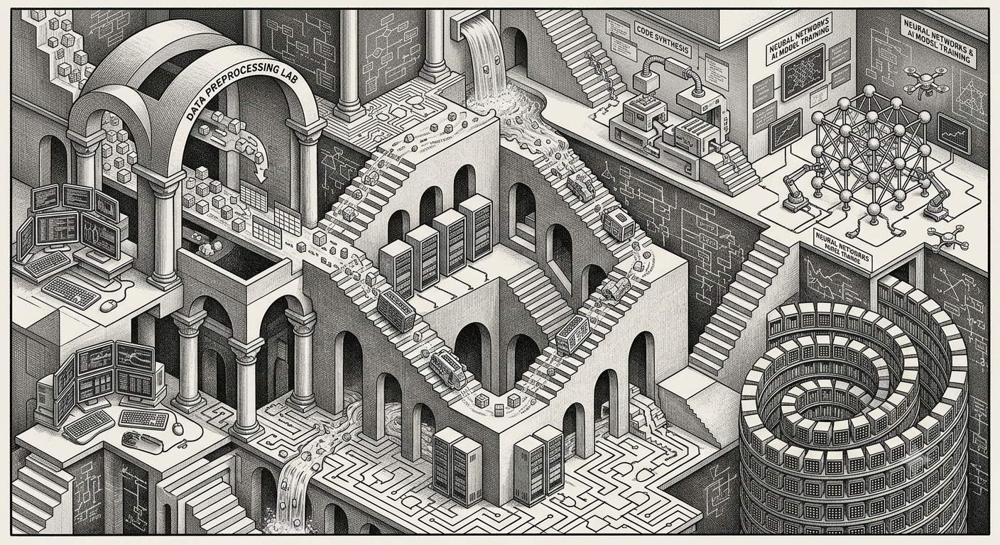

Open main menu

[Home](../)[Teaching](../courses/)[Research](../research/)[Research advice](../research-advice-for-students/)[Project Students](../students/)[About me](../about/)

# Project Students

If you have any ideas for a project that fits within my interests, then please feel free to come and discuss it with me. If you are trying to find a topic then there are some areas to consider on the tabs below.

I look to take on students who are intelligent (which you are by definition of being a Birkbeck student) and who have an interest in the project that they are about to undertake. Students should be self-motivated and be keen to explore their topic. You should not be afraid to express your ideas and follow them. However, you need to be balanced in your approach and practice scientific practices in evaluating your own work. If you have the basics, we can work together to put together a good solid project.

I like to see students take control of their project and run with their ideas and thoughts. This means that students exercise a degree of independence - however, I don’t expect this to translate to going off into a dark corner and never consulting me. My role is to provide some guidance and advice. There is clearly a conflict between these two expectations and so what we need to do is work together to strike a suitable balance between self-direction/independence and guidance.

Bottom line - it is your project and the supervisor only makes suggestions...

## Possible project topics

- You are encouraged to discuss your ideas and maybe we can shape them into an honours or masters project.

- I’ve been asked repeatedly to distinguish between Artificial Intelligence, Machine Learning, and Deep Learning, and[this article](https://docs.microsoft.com/en-gb/azure/machine-learning/service/concept-deep-learning-vs-machine-learning)helps with the differences.

## Writing guides

[A guide to writing MSc dissertations](../resources/projects/diss-how-final.pdf)[The Elements of Style](https://en.wikipedia.org/wiki/The_Elements_of_Style)

MSc project proposal template

The following is a general template for a**masters level**project proposal under my supervision, and therefore, software-based.

- Title
- Disclaimer (stating your own work etc. - usual plagiarism requirements)
- Abstract
- Acknowledgements (optional)
- Contents
- 

Chapter 1 - Introduction

  - State the problem you are trying to solve
  - Why is it worth tackling?
  - What approaches are available (briefly)?
  - What approach have you chosen?
  - Any special knowledge you presume of the reader to understand the proposal.
  - Any special typography or terminology (if too many use a glossary).
  - A “road map” of the proposal document … “In Chapter Two we describe xxxx. In Chapter Three we describe yyyy…”

- 

Chapter 2 - Background

  - Any information the reader requires in terms of techniques/technology that isn’t part of the programme you have studied.

- 

Chapter 3 - Analysis, Requirements, and Design

  - What it says on the title
  - Should include appropriate formal design diagrams/notation as necessary
  - Any language selection, libraries, frameworks, etc., and why you have selected them.
  - If you’ve written some code then discuss this briefly and how this will impact the final work.

- 

Chapter 4 - Experimentation & Evaluation

  - Again, what it says on the tin!
  - Briefly describe how you are going to show that your work meets the original aims and objectives; this doesn’t mean just testing the code!

- 

Chapter 6 - Timescale

  - Provide a GANTT chart which shows the timeline for your work. Probably a topic, rather than week-by-week, view will be most useful to the examiners.

Now, “one size does not fit all” - this structure is meant to be a starting point; you may have more, or less, chapters. Be flexible and check with me about what you are writing.

I prefer to see the proposal a section at a time (or even just a few pages at the start). A whole proposal sent to me to read at the end, with no chapters submitted prior to that, is a recipe for problems. It really doesn’t give me any time to say, “No, change the style”, or “No, I suggest you do it this way”.

MSc project report template

The following is a general template for a project report under my supervision (and software-based). It is not necessarily the structure other staff members would recommend, but it works for me!

First, don’t bother with the abstract, introduction, and conclusions - they are the last things you write. Next, if you have a lot of code (being supervised by me probably means “yes”) then put it on GitHub (or equivalent) as a private repository and include a link to that. Don’t fill appendices with many code listings—think of the trees. Your code must be available via a`GitHub`repository under the Birkbeck Organisation and not publicly visible.

So, here is the outline:

- Title
- Disclaimer (stating your work, etc. - usual plagiarism requirements)
- Abstract
- Acknowledgements (optional)
- Contents
- 

Chapter 1 - Introduction

  - State the problem you are trying to solve
  - Why is it worth tackling?
  - What approaches are available (briefly)?
  - What approach have you chosen?
  - Any special knowledge you presume of the reader
  - Any special typography or terms
  - A “road map” of the report….. “In Chapter Two, we describe xxxx. In Chapter Three, we describe yyyy…”

- 

Chapter 2 - Background

  - Any information the reader requires regarding techniques/technology that isn’t part of your study programme. You can include a reference to the proposal if necessary or, if required to provide context, include materials from the proposal. You should not do a cut-and-paste function but reword, enhance, and restructure the reused material and include a statement that this material is based upon your proposal.

- 

Chapter 3 - Analysis, Requirements, and Design

  - What it says on the title
  - Should include appropriate formal design diagrams/notation as necessary

- 

Chapter 4 - Implementation

  - Describe how the implementation maps onto the design you have already discussed.
  - You should use “code snippets” to illustrate particular features of your work or tricky (awkward) bits of coding. Don’t make these snippets longer than half a page (and include line numbers if possible). Break the code fragment into smaller bits if it is over half a page.
  - Describe the code in terms of the overall architecture and the snippets. Make sure the reader understands what you have done and why!

- 

Chapter 5 - Experimentation & Evaluation

  - Again, what it says on the tin!
  - If you haven’t done too much testing (for instance, it is GUI-based), include a “walk-through” of the application with screenshots showing the scenarios in which it can be used. After all, the examiners may not be near a computer to actually “run” your code.
  - You must also clearly show how you evaluated your work and how it meets the original aims and objectives.

- 

Chapter 6 - Conclusions

  - Restate the problem.
  - Say how successful (or not) you have been in solving/tackling the problem.
  - What would you have done differently?
  - What have you learnt?
  - Basically, “reflect” on the work you have done.
  - What additional features/extensions can be done to the work, and what would you have done if you had more time?

- 

Appendices

  - Include design diagrams, data formats, etc.
  - Basically, don’t overfill the report.
  - Link to the GitHub repository (if appropriate).

Now, “one size does not fit all” - this structure is meant to be a starting point; you may have more or fewer chapters. You may need a background chapter, you might not, etc. Be flexible and check with me about what you are writing.

I prefer to read the report chapter by chapter (or even just a few pages at the start). A whole report sent to me to read at the end, with no chapters submitted before that, is a recipe for problems. It doesn’t give me any time to say, “No, change the style”, or “No, I suggest you do it this way”.

A selection of past project reports and proposals

These examples must not be distributed without prior agreement.

[Nitesh Chacowry — project proposal](../resources/samples/proposals/chacowry---project-proposal.pdf)[Nitesh Chacowry — final report](../resources/samples/final/chacowry.n-final.pdf)[Akira Charoensit — project proposal](../resources/samples/proposals/a_charoensit_13150718_project_proposal_562011_1699142160.pdf)[Geoff Falk — final report](../resources/samples/final/geoff-falk.pdf)[Amy Peters — project proposal](../resources/samples/proposals/peters.a-project-proposal.pdf)[Amy Peters — final report](../resources/samples/final/petersafinal.pdf)[Joanna Pinto — project proposal](../resources/samples/proposals/pinto.j-project-proposal.pdf)[Joanna Pinto — final report](../resources/samples/final/pintoj-final.pdf)[Michael Sauter — final report](../resources/samples/final/sauter-report_110502.pdf)

[Home](../)[Teaching](../courses/)[Research](../research/)[Research advice](../research-advice-for-students/)[Project Students](../students/)[About me](../about/)© 1986-2026 KEITH LEONARD MANNOCK All rights reserved.